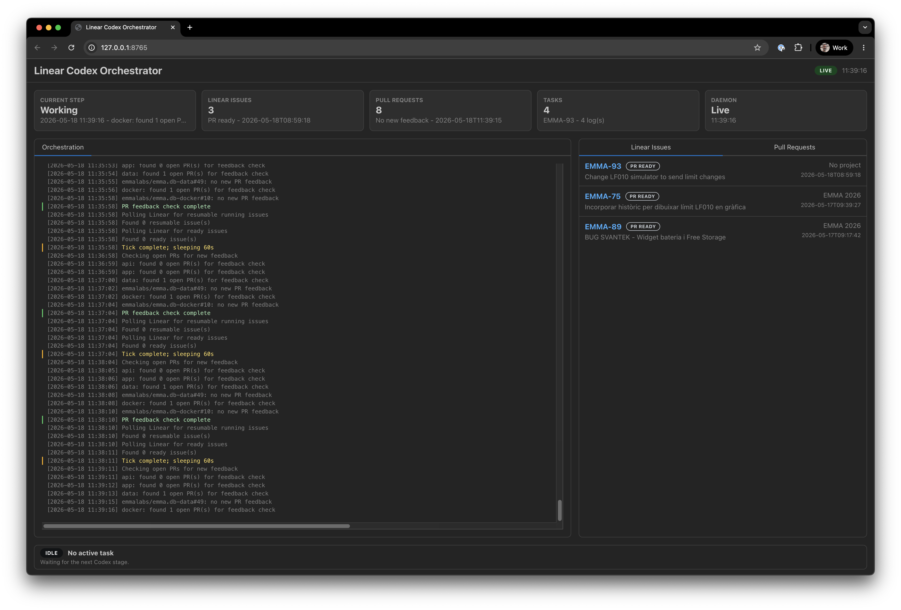

# Linear Codex Orchestrator

Local daemon that polls Linear issues, runs Codex against one or more local repositories, opens ready-for-review pull requests, and monitors PR feedback.

1. Codex CLI for planning, implementation, and review.
2. Linear GraphQL API for fast polling, status, labels, and comments when a Linear API key is saved in the dashboard.
   If no API key is saved, Linear MCP through Codex CLI is used as a fallback.
3. GitHub CLI for ready-for-review PR creation/update and PR feedback checks.

By default, every Todo issue in a configured Linear team is eligible. Use the Orchestrator tab if you want an explicit ready-label gate such as `codex-ready`.



## Workflow Summary

The orchestrator runs a local control loop that coordinates Linear, Codex, Git, and GitHub from the repositories configured in the dashboard Workspaces tab.

On each tick it:

1. Checks open GitHub PRs whose branch starts with the configured PR feedback branch prefix (`codex/` by default) and processes any new comments or review feedback.
2. Looks for resumable Linear issues in the configured in-progress status that still carry the running label.
3. If nothing is being resumed, polls Linear for eligible Todo issues, optionally filtered by the configured ready label.

For each Linear issue, the orchestrator:

1. Resolves the issue's Linear team key to a configured workspace and acquires a workspace lock so only one issue runs there at a time.
2. Reads the full Linear issue context through the direct Linear API when an API key is configured, or through the Codex Linear MCP fallback otherwise.
3. Runs a read-only Codex planning pass. If the planner returns `BLOCKED:`, the issue is labeled with the configured blocked label and no code is changed.
4. Posts the plan to Linear, moves the issue to the configured in-progress status, adds the configured running label, and creates the same branch in every candidate repo: `codex/<issue-id>-<slug>`.
5. Runs Codex implementation across the workspace, then detects which configured repositories actually changed.
6. Runs a Codex optimization pass for changed repositories, followed by a read-only Codex review pass.
7. If review fails, runs one reviewer-fix pass and reviews again. A failed second review blocks automatic PR creation and leaves a Linear comment.
8. For passing reviewed changes, commits each changed repository, pushes the branch, creates or updates a ready-for-review GitHub PR, attaches the PR to Linear, moves the Linear issue to the configured in-review status, and removes the running label.

If a daemon run is interrupted after an issue was moved to the in-progress state, the next tick first searches for issues with the configured running label, checks out the existing branch in each configured repo, and resumes from the current working tree instead of starting from the base branch again.

PR feedback handling is separate from the issue implementation flow. For each open matching PR, the orchestrator records which GitHub issue comments, review comments, and reviews it has already processed. New feedback checks out the PR branch, runs Codex with the feedback-focused prompt, commits and pushes any fixes, and comments back on the PR with the result.

## Recommended Human Workflow

It is good practice to enable GitHub reviews on orchestrator PRs. The orchestrator checks open PRs for new GitHub review comments, issue comments, and submitted reviews, then uses Codex to address that feedback and push follow-up fixes.

A typical human workflow is:

1. Create the Linear issue in the backlog.
2. Use Codex plan mode manually to create an implementation plan, then add that plan as a Linear comment.
3. Move the Linear issue to Todo when it is ready for automation.
4. Wait for the orchestrator to finish the implementation work and open or update the PR.
5. Wait some time for Codex review feedback and for the orchestrator to process any fixable feedback.
6. Check the PR manually before merging.

## Prerequisites

Configuration is normally done in the local dashboard, not by editing `.env`. `./scripts/setup.sh` installs missing command-line prerequisites when it can:

- Python 3.9+
- Node.js/npm for the React dashboard build
- Git
- GitHub CLI (`gh`)
- Codex CLI (`codex`)

If `codex` is not already installed, setup installs it globally with `npm install -g @openai/codex`. Authentication is still interactive:

- Run `codex --login` if setup reports Codex is not logged in.
- Install the Linear MCP server with `codex mcp add linear --url https://mcp.linear.app/mcp`.
- Run `codex mcp login linear` if `codex mcp list` shows Linear as `Not logged in`.
- Confirm `codex mcp list` shows Linear enabled and authenticated.
- Run `gh auth login` if setup reports GitHub CLI is not authenticated.
- Confirm `gh` has access to the GitHub organizations and repositories you want to select in the Workspaces tab.
- For faster Linear polling and comments, save a Linear personal API key in the Orchestrator tab.
- Leave the Codex model field empty unless you know a specific model works with your Codex account.
- Use the Orchestrator tab to choose Codex reasoning effort, sandbox mode, and fast mode.
- The daemon console shows orchestration progress only. Detailed Codex stage output is written under `.logs/`.

## Quick Start

```bash
cd linear-codex-orchestrator
./scripts/setup.sh
```

Start the daemon:

```bash
./scripts/run.sh
```

Open `http://127.0.0.1:8765`, then configure the dashboard:

- `Workspaces`: map Linear team keys to local workspace folders and repositories.
- `Orchestrator`: set Linear routing, runtime behavior, Codex model/reasoning/sandbox options, dry run, and hot reload.

The wizard autosaves a private `.orchestrator/config.db` SQLite database that is ignored by git. Hot reload is enabled by default, so saved setup changes apply before the next daemon tick. If you disable hot reload, restart the daemon after saving config changes.

The default config runs for real, so the daemon can update Linear, push branches, and open pull requests. To test configuration without mutations, enable Dry run in the Orchestrator tab.

Daemon mode also starts the React dashboard at `http://127.0.0.1:8765` so you can follow orchestration logs, issue/PR status, and inspect detailed Codex stage logs. `./scripts/setup.sh` builds the dashboard, and `./scripts/run.sh` builds it automatically if `frontend/dist/` is missing.

For code hot reload while developing the orchestrator, run:

```bash
./scripts/dev.sh
```

Then open `http://127.0.0.1:5173`. Frontend changes hot-reload through Vite. Python changes under `src/` restart the backend daemon automatically between runs.

Each normal tick first checks open `codex/` PRs for new GitHub comments and review feedback, then polls Linear for new implementation work.

Run only the PR feedback worker:

```bash
./scripts/run.sh pr-comments-once
./scripts/run.sh pr-comments-daemon
```

Or schedule `./scripts/run.sh once` from cron or systemd on this machine.

## Configuration

Configuration is normally managed in the dashboard and stored in `.orchestrator/config.db`, a private SQLite database ignored by git. Each save in the Workspaces or Orchestrator tab autosaves the normalized settings there.

At runtime the daemon loads settings in this order:

1. `.orchestrator/config.db`, or the SQLite database pointed to by `ORCHESTRATOR_CONFIG_PATH`.
2. Environment variables from the shell or `.env`, for fallback/headless deployments.
3. Built-in defaults.

With config hot reload enabled, the daemon reloads the SQLite config before the next daemon tick. Reloads happen between ticks, not while a Codex task is mid-run. If you disable hot reload, restart the daemon after saving dashboard changes.

### Workspaces

The Workspaces tab maps Linear team keys to local workspaces. The saved internal workspace shape is:

```json
{
  "ENG": {
    "path": "/home/alex/projects/product",
    "repos": {
      "web": {
        "github": "example/product-web",
        "path": "/home/alex/projects/product/web",
        "base": "develop"
      },
      "api": {
        "github": "example/product-api",
        "path": "/home/alex/projects/product/api",
        "base": "main"
      }
    }
  }
}
```

Codex can change any repository listed for the issue's Linear team. No per-repository Linear labels are required.

When you choose a workspace folder in the folder explorer, the dashboard adds the selected folder itself when it is a git repository and also scans direct child folders for git repositories. Detected repositories are merged into the workspace table with:

- repo key derived from the folder name
- local path
- GitHub repository read from the `origin` remote when it points to GitHub
- base branch read from `origin/HEAD` or the current branch

Existing manually edited repository rows are preserved.

The GitHub repository select uses the authenticated GitHub CLI and lists repositories returned by `gh api /user/repos`, including organization and collaborator repositories when your token has access.

### Orchestrator

The Orchestrator tab controls:

- Linear labels and statuses
- optional Linear API key
- max issues per tick
- lock directory
- optional test command
- PR feedback branch prefix
- dry run
- config hot reload
- Codex model, reasoning effort, sandbox, and fast mode

### Headless fallback

Environment variables from `.env` still work as a fallback for automation or headless deployments. When `.orchestrator/config.db` exists, values in that SQLite config take precedence over environment variables.

Use `ORCHESTRATOR_CONFIG_PATH=/path/to/config.db` when you need the daemon or dashboard to read and write a SQLite config database somewhere other than `.orchestrator/config.db`.

For a headless workspace bootstrap, set `WORKSPACE_MAP_JSON` to the same JSON object shape saved by the Workspaces tab. The older `REPO_MAP_JSON` name is also accepted for compatibility. This is the fallback form, not the recommended interactive setup path.

Headless deployments can also provide the Orchestrator tab fields through env vars, including `LINEAR_API_KEY`, `LINEAR_READY_LABEL`, `LINEAR_RUNNING_LABEL`, `LINEAR_BLOCKED_LABEL`, `LINEAR_TODO_STATUS`, `LINEAR_IN_PROGRESS_STATUS`, `LINEAR_IN_REVIEW_STATUS`, `DRY_RUN`, `CODEX_MODEL`, `CODEX_REASONING_EFFORT`, `CODEX_FAST_MODE`, and `CODEX_SANDBOX`.

For a one-off dry-run without changing saved dashboard config, run:

```bash
DRY_RUN=true ./scripts/run.sh
```

## Prompts

Codex prompts live in Markdown files under `prompts/`:

- `planner.md`
- `implementation.md`
- `optimizer.md`
- `reviewer.md`
- `review_fix.md`
- `pr_feedback_fix.md`

Edit those files to tune behavior without changing Python code.

## Dashboard

The web UI is a Vite React app under `frontend/`. The Python daemon serves the compiled static files from `frontend/dist/`.

Top-level dashboard tabs:

- `Dashboard`: orchestration log, issue/PR status, and Codex stage summaries.
- `Workspaces`: local workspace and repository setup.
- `Orchestrator`: daemon, Linear, and Codex settings.

The local server exposes these APIs:

- `/api/config`
- `/api/browse`
- `/api/github/repos`
- `/api/status`
- `/api/orchestrator`
- `/api/logs`
- `/logs/<name>`

For full-stack development with code hot reload, run:

```bash
./scripts/dev.sh
```

Open `http://127.0.0.1:5173`. Vite hot-reloads frontend changes. The dev runner watches `src/**/*.py` and restarts the backend daemon when Python code changes.

For frontend-only development, run:

```bash
npm --prefix frontend install
npm --prefix frontend run dev
```

The Vite dev server proxies API calls to the daemon on `127.0.0.1:8765`.

## Safety Model

- Todo issues are processed by default; the configured ready label can optionally narrow the queue.
- A local lock file prevents concurrent work per workspace.
- Each issue gets the same branch name in every candidate repo: `codex/<ISSUE-ID>-<slug>`.
- The service never pushes to `main`.
- The reviewer runs Codex in read-only sandbox mode.
- Dry run is off by default. Enable it in the Orchestrator tab, or use the fallback `DRY_RUN=true` env var, only when you want to verify configuration without mutating GitHub/Linear or pushing branches.
- Human merge approval remains outside this service.

## Contributing

Contributions are welcome. See [CONTRIBUTING.md](CONTRIBUTING.md) for local development checks and pull request guidance.

## Security

Please report security issues privately. See [SECURITY.md](SECURITY.md).

## License

MIT. See [LICENSE](LICENSE).
